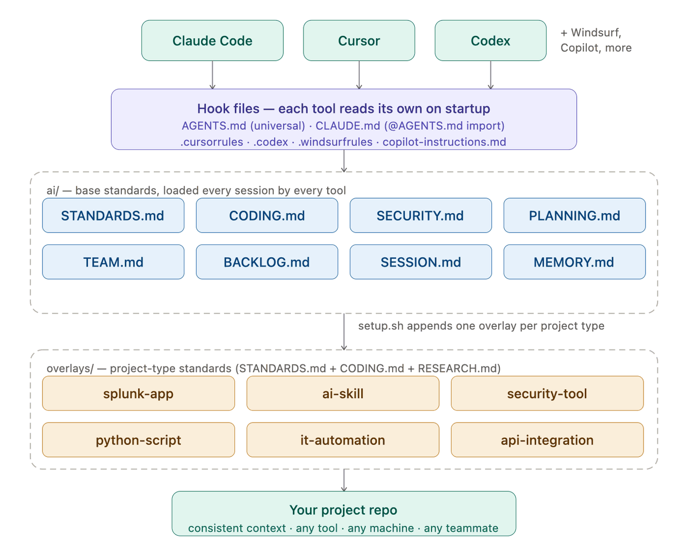
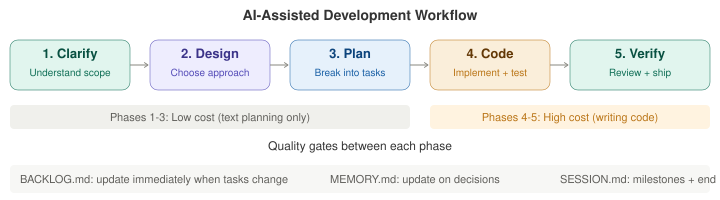

# Quick Start Guide

> 🤖 **AI agents: read [`AGENT_RUNBOOK.md`](https://github.com/Robiton/ai-project-scaffold/blob/main/docs/AGENT_RUNBOOK.md) instead.**
> Absolute on purpose: this file ships to adopters and the runbook does not. `docs/` is
> REFRESH-only, so a doc that did not already exist in your tree never arrives by upgrade.
> This page is a walkthrough for a person. The runbook is commands, expected results and
> exit-code rules — everything needed to set up, verify, upgrade or apply an overlay.

Get from zero to a fully scaffolded project in under 5 minutes.

---

## Architecture



The scaffold gives every AI tool the same context through a chain:
**Hook file** (AGENTS.md) **->** **Base standards** (ai/ folder) **->** **Overlay** (project-type rules) **->** **Your project**

---

## Which path are you on?

```
                    ┌─────────────────┐
                    │  Start here     │
                    └────────┬────────┘
                             │
                    Is this a new project
                    or an existing one?
                             │
              ┌──────────────┴──────────────┐
              │                             │
        ┌─────┴─────┐               ┌──────┴──────┐
        │  NEW repo  │               │  EXISTING   │
        └─────┬─────┘               │    repo     │
              │                      └──────┬──────┘
     Clone scaffold                         │
     Run setup.sh              See docs/ADOPTION_GUIDE.md
     Fill templates                (11-step walkthrough)
     First AI session                       │
              │                             │
              └──────────┬──────────────────┘
                         │
                ┌────────┴────────┐
                │  Ready to work  │
                └─────────────────┘
```

---

## New project — step by step

### 1. Clone the scaffold

```bash
git clone https://github.com/Robiton/ai-project-scaffold.git my-project
cd my-project
```

Or if the repo is set as a GitHub template: click **"Use this template"** on the repo page.

### 2. Run setup

```bash
./setup.sh
```

You'll be asked:
- **Project type** — selects which overlay to apply (Splunk, Python, API, etc.)
- **Project name** — used in version file and app.conf
- **Initial version** — defaults to `0.1.0`
- **Your name** — recorded in SESSION.md and TEAM.md

For Splunk projects, you'll also answer: new vs existing, UCC vs conf-only, Splunk version, deployment target.

### 3. Fill in your project context

Open these files and replace the template content:

| File | What to fill in |
|------|-----------------|
| `ai/MEMORY.md` | Project overview, architecture decisions, known gotchas |
| `ai/TEAM.md` | Team roster, ownership, working agreements |
| `ai/BACKLOG.md` | Initial tasks — what needs to be done first |
| `ai/SESSION.md` | First entry: "Scaffold initialized, project context filled in" |

### 4. Commit and push

```bash
git add .
git commit -m "chore(scaffold): initialize v$(cat version)"
git push origin main
```

### 5. Start your first AI session

Open the project in Claude Code, Cursor, Codex, or any supported tool. Send this as your first message:

> "Read ai/STANDARDS.md and load all files in the order it specifies before we begin any work."

The tool will load all context and be ready to work with full awareness of your standards, backlog, and history.

---

## Development workflow



Every task follows five phases. Phases 1-3 are cheap (planning); phase 4 is expensive (code). Investing early prevents rework.

| Phase | What you do | Quality gate |
|-------|-------------|--------------|
| **1. Clarify** | Understand requirements, ask questions, confirm scope | Requirements are unambiguous |
| **2. Design** | Choose architecture, identify files, decide approach | Trade-offs documented |
| **3. Plan** | Break into small tasks with file paths | Each task completable in one pass |
| **4. Code** | Implement — test-first when possible | Tests pass, matches plan |
| **5. Verify** | Review against requirements, run full test suite | Code reviewed, BACKLOG.md updated |

**Shortcut for small changes:** Bug fixes and typos can skip to Plan -> Code -> Verify.

**Updating the scaffold itself** (not your `ai/` files): `./setup.sh --upgrade --dry-run`,
then `./setup.sh --upgrade`. It merges upstream changes into your standards files while
leaving your session log, backlog, memory, team and `version` untouched. Details and
failure modes: `docs/TROUBLESHOOTING.md` → *Updating to a newer scaffold release*.

**When to update ai/ files:**
- `ai/BACKLOG.md` — immediately when tasks change status (any phase)
- `ai/MEMORY.md` — immediately when design decisions are made (typically phase 2)
- `ai/SESSION.md` — at **milestones and at the end** (each merged PR or completed task,
  and before any context compaction). The `tools/session_journal.sh` hook records the
  facts continuously so a session that dies early loses narrative, not work.

---

## Before every session

Run the sync check to make sure your context is current:

```bash
./sync-check.sh
```

This compares your local `ai/` files against the remote. If someone else pushed changes, you'll be told to pull first.

---

## Key files at a glance

| File | Purpose | When to update |
|------|---------|----------------|
| `AGENTS.md` | Universal hook — tells all AI tools to load standards | Rarely (only if bootstrap changes) |
| `ai/STANDARDS.md` | Load order, session rules, git workflow, versioning | When standards change |
| `ai/CODING.md` | Style, naming, file headers, commit format | When conventions change |
| `ai/SECURITY.md` | Mandatory security rules (no exceptions) | When security requirements change |
| `ai/PLANNING.md` | Workflow phases, spec format, release checklist | When process changes |
| `ai/BACKLOG.md` | Living to-do list | Every session (as tasks change) |
| `ai/SESSION.md` | What happened, decisions, next steps | Milestones **and** end of session |
| `ai/MEMORY.md` | Architecture decisions, known gotchas | When decisions are made |
| `ai/TEAM.md` | Who does what, ownership, agreements | When team changes |

---

## Git workflow (merge-only)

```bash
# Start work
git checkout main && git pull origin main
git checkout -b feature/your-work

# Commit and PR
git add . && git commit -m "type(scope): description"
git push origin feature/your-work
# Open PR in GitHub

# Keep branch current (if main moves ahead)
git fetch origin && git merge origin/main
git push origin feature/your-work

# After PR merges
git checkout main && git pull origin main
```

Never rebase. Never commit directly to main.

---

## Need help?

- **Full design explanation:** [OVERVIEW.md](https://github.com/Robiton/ai-project-scaffold/blob/main/OVERVIEW.md)
  — absolute on purpose: this file ships to adopters and `OVERVIEW.md` is removed at
  adoption, so a relative link here resolves only inside the scaffold's own checkout.
- **Adding scaffold to existing project:** [ADOPTION_GUIDE.md](ADOPTION_GUIDE.md)
- **Common issues:** [TROUBLESHOOTING.md](TROUBLESHOOTING.md)
- **Creating a new overlay:** [CONTRIBUTING.md](../.github/CONTRIBUTING.md#creating-a-new-overlay)
